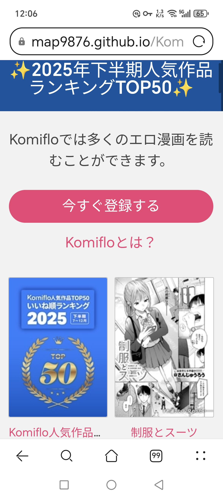

# Komiflo 2025 Manga Rank Toplist

2026年4月 [Komiflo](https://komiflo.com) 官方发布的 **2025年下半期人気作品ランキングTOP50** 静态备份。

## About

原网站: [https://komiflo.com/#!/collection/4522946](https://komiflo.com/#!/collection/4522946?page=2)



This is a local/offline backup of the public Komiflo collection ranking page #4522946. The content includes:

- **47 unique manga entries** with titles, authors, and cover images
- **51 cover images** (WebP format, ~60% smaller than JPG)
- **Original website CSS/styling** preserved for authentic appearance
- **Merged from 3 pages** into a single browsable page

## How to Use

Simply open `index.html` in any web browser. All resources (CSS, fonts, images) are stored locally - no internet connection required.

## Structure

```
.
├── index.html              # Main page (merged ranking list)
├── README.md               # This file
├── app-af42325ea38ed3dd32b3.css  # Original Komiflo website CSS
├── covers/                 # 51 manga cover images (WebP)
│   └── jpg/                # Original JPG backup
├── cid/                    # CID-referenced inline CSS resources
├── css/                    # Font stylesheets
├── assets/                 # Additional static assets
├── Komiflo (4)             # 原始MHT网页存档（第1页）
├── Komiflo (5)             # 原始MHT网页存档（第2页）
└── Komiflo (6)             # 原始MHT网页存档（第3页）
```

## Implementation Details

### How It Works

原始 MHT 存档包含3个分页，每页都有独立的页码导航和页脚。本项目实现了：

1. **提取漫画条目** - 使用 Python 脚本解析 HTML，提取所有 `<div class="module w3 comic-preview center">` 元素
2. **移除分页元素** - 删除页码导航（`<ul class="pagination">`）和页脚（`<footer>`）
3. **合并为连续列表** - 将所有51个漫画条目排列成单一连续页面
4. **保持原始样式** - CSS 和页面结构完全保留，仅移除分页相关元素

### Technical Implementation

```python
# 提取漫画条目的核心逻辑
parts = content.split('<div class="module w3 comic-preview center">')
manga_entries = []
for part in parts[1:]:
    end_pos = part.find('</p></div></div>')
    if end_pos != -1:
        manga_html = '<div class="module w3 comic-preview center">' + part[:end_pos + len(end_pattern)]
        manga_entries.append(manga_html)
```

### Preserved Elements (Not Displayed)

以下元素在原始存档中存在，但为保持页面简洁而未显示：

- **页码导航**: `<ul class="pagination"><li><span>1</span></li><li><a href="index.html">2</a></li><li><a href="index.html">3</a></li></ul>`
- **页脚内容**: 
  - 会社概要
  - 利用規約
  - 特定商取引法に基づく表示
  - 企業ポリシー
  - サポート
  - ログイン
  - 社交媒体链接（Twitter, Bluesky）
  - 版权信息：© Komiflo Co., Ltd. All rights reserved.

## Source

Content extracted from public ranking pages on [komiflo.com](https://komiflo.com). This is a public ranking/list page - all content is publicly available on the official website and Twitter.

## GitHub Pages

This site is also available via GitHub Pages: [https://map9876.github.io/Komiflo-2025-manga-rank-toplist/](https://map9876.github.io/Komiflo-2025-manga-rank-toplist/)

---

# DLsite 封面搜索工具

从 Komiflo 排行榜 HTML 中提取漫画标题，在 DLsite 搜索匹配作品并获取封面图片 URL。

## 工作原理

1. 从本项目的 HTML 文件中用正则提取漫画标题
2. 对每个标题，通过 CDN 代理依次搜索 DLsite 的 `maniax`（同人）和 `book`（漫画）分区
3. 用标题匹配度评分（exact > startswith > partial）选择最佳结果
4. 通过 AJAX API 获取匹配作品的封面图 URL

## 尝试过的方法

### 1. 直接访问 DLsite API（失败）
- DLsite 对直接请求有地区限制/反爬，从大陆 IP 无法直接访问
- 返回 403 或超时

### 2. 通过 CDN 代理访问（成功）
- 使用 `https://c.map987.dpdns.org` 作为反代
- 所有 API 请求格式：`{CDN}/https://www.dlsite.com/...`
- 搜索 API：`/maniax/api/=/product.json?keyword={keyword}` 和 `/book/api/=/product.json?keyword={keyword}`
- 作品详情 AJAX API：`/maniax/product/info/ajax?product_id={workno}`

### 3. 标题匹配策略
- 日文标题含全角符号（！？．），需要 normalize 后比较
- 优先 exact match，其次 startswith，最后 partial match
- 部分 Komiflo 标题带有「最終話」「前編」等后缀，搜索前已剥离

### 4. 封面图字段
AJAX API 返回的 JSON 中，封面图可能在以下字段：
- `work_image` — 最常见
- `image_main` — 备用
- `image_url` — 备用

返回的 URL 是协议相对路径（`//img.dlsite.jp/...`），代码中补全为 `https:`。

## 是否修改了获取 API 的代码

**是的，做了以下修改：**
- 最初尝试直接请求 DLsite，失败后改用 CDN 代理
- 最初只搜索 `maniax` 分区，后来加上 `book` 分区以覆盖更多漫画类型
- `get_cover()` 函数最初只查 `work_image` 字段，后来加了 `image_main` 和 `image_url` 的 fallback

## 搜索结果（2025上半期 TOP50，找到45部，未找到5部）

数据来源：`/workspace/komiflo_press_release.html`（Komiflo 2025年上半期人気作品ランキングTOP50）

### 已找到（45部）

| # | 作家 | 作品 | DLsite Work No |
|---|------|------|---------------|
| 1 | ぼるしち | ずっと一緒にいてあげるから 後編 | BJ02035820 |
| 2 | どじろー | 陰キャ同士の付き合う直前が一番エロいよね #1 | BJ02104607 |
| 3 | ゆるた | 重衣里さんは困らせたい | BJ01990810 |
| 4 | 楝蛙 | のらね娘 | BJ01851118 |
| 5 | どじろー | 陰キャ同士の付き合う直前が一番エロいよね #3 | BJ02104607 |
| 6 | みぞれ | 家事代行の水谷さん | BJ02064402 |
| 7 | 楝蛙 | 桃どろぼう | BJ02064397 |
| 8 | 多紋サカキ | おたわむれを教えて | BJ01972974 |
| 9 | 亜美寿真 | たぶん瑞希さんは振られた。 | BJ01979541 |
| 10 | ウチガワ | えっち宣言 | BJ02033829 |
| 11 | さじぺん | 気になる躰 | BJ01914824 |
| 12 | 仲町まち | はんぶんこ。 | BJ01906184 |
| 13 | えーすけ | よりみち #3 | BJ02428907 |
| 14 | MURO | スリーピース・バインド | BJ01979544 |
| 15 | 多紋サカキ | こたえあわせ | BJ02370698 |
| 16 | どじろー | 陰キャ同士の付き合う直前が一番エロいよね #2 | BJ02104607 |
| 17 | ごさいじ | あとさきのさき | BJ01886804 |
| 18 | どらのやま | だって発情しちゃうから | BJ01874252 |
| 19 | 楝蛙 | おとなみならい | BJ01933023 |
| 20 | きづかかずき | エロ漫研へようこそ | BJ01828089 |
| 21 | ぴょん吉 | ニアリーイコール | BJ01906183 |
| 22 | Reco | ずっとガマンしてたから | BJ02019905 |
| 23 | さんじゅうろう | わからせタイトルマッチ! | BJ01933021 |
| 24 | 南文夏 | 大人になったね | BJ01851122 |
| 25 | ウチガワ | リスタート・エラー | BJ02082477 |
| 26 | 層積 | ふぞろい | BJ02389805 |
| 27 | ももこ | 幼馴染とセフレになる日 | BJ01886806 |
| 28 | 星井情 | ストレンジャー | RJ01586084 |
| 29 | 仲町まち | 最後の日に。 | BJ01990809 |
| 30 | ひとにたち | 凛としてかわいい | BJ01838240 |
| 31 | kakao | バックヤードのふたり | BJ01990807 |
| 32 | kakao | エンジェリック・カズン | BJ01867056 |
| 33 | フグタ家 | 冬と現場と作業ギャル | BJ01851121 |
| 34 | 昼寝 | 柊先輩くんくんくんくん | BJ02064412 |
| 35 | さじぺん | パシリちゃんにお願い | BJ01838239 |
| 36 | ウチガワ | ワンナイト・エラー | BJ01904487 |
| 37 | きづかかずき | エロ漫研の日常 | BJ01951011 |
| 38 | Hamao | コネクト+ | BJ01851119 |
| 39 | エロ井ロエ | 絶滅危機回避ファイル 妖精-チターニア種-の場合 | BJ01851124 |
| 40 | 蛸田こぬ | あまねさんといっしょ | BJ01985500 |
| 41 | 層積 | 夜交 | BJ02019908 |
| 42 | 橙織ゆぶね | すきくらべ | BJ02019911 |
| 43 | すずしも | しあんのほか | BJ01951018 |
| 44 | どちゃしこ | 義妹のネトらせない配信 | BJ01858459 |
| 45 | 荒巻越前 | 最後の夏の過ごし方 | BJ02100503 |

### 未找到（5部）

| # | 作家 | 作品 |
|---|------|------|
| 1 | えいとまん | セックスは陽キャのものだけじゃねぇ! |
| 2 | えーすけ | DIVE!! |
| 3 | 南文夏 | スポットライト |
| 4 | ふじざらし | ぽーかーふぇいす2 |
| 5 | Hamao | マーブル |

### 关于封面文件数量

`covers/dlsite/` 目录有 63 个文件而非 50 个，原因：
- 本次从 press release 搜索下载了 45 个（其中「陰キャ同士」#1/#2/#3 共用同一张封面 BJ02104607）
- 之前会话已下载了 20 个（属于 2025 下半年排名的封面，如 BJ01403015、BJ02072651 等）
- 两次下载的文件名不同，所以累积为 63 个

## DLsite 封面图片 URL 规则

### URL 路径结构

```
https://img.dlsite.jp/{类型}/images2/work/{分区}/{ID范围}/{产品ID}_img_{部分}.{格式}
```

### 类型
| 类型 | 说明 |
|------|------|
| `resize` | 缩略图（有尺寸后缀） |
| `modpub` | 原图/大图 |

### 分区
| 分区 | 说明 |
|------|------|
| `doujin` | 同人（RJ 开头） |
| `books` | 漫画/书籍（BJ 开头） |
| `professional` | 商业作品（VJ 开头） |

### 图片部分
| 部分 | 说明 |
|------|------|
| `img_main` | 主封面图 |
| `img_smp1` ~ `img_smpN` | 试看样本页 |
| `img_sam` | 缩略封面（旧格式） |

## 真实封面链接示例

### 缩略图 → 原图（来自 maxurl #1312）

**书籍 (BJ)：**
```
缩略图: https://img.dlsite.jp/resize/images2/work/books/BJ617000/BJ616372_img_main_240x240.jpg
原  图: https://img.dlsite.jp/modpub/images2/work/books/BJ617000/BJ616372_img_main.jpg
```

**同人 (RJ)：**
```
缩略图: https://img.dlsite.jp/resize/images2/work/doujin/RJ438000/RJ437590_img_smp4.webp
原  图: https://img.dlsite.jp/modpub/images2/work/doujin/RJ438000/RJ437590_img_smp4.jpg
```

### 从缩略图 URL 转换为原图 URL 的规则

```python
def get_original_url(thumb_url: str) -> str:
    """将 DLsite 缩略图 URL 转换为原图 URL。"""
    url = thumb_url
    # 1. resize → modpub（去掉缩略图 CDN）
    url = url.replace("/resize/", "/modpub/")
    # 2. 去掉尺寸后缀（如 _240x240, _100x100）
    url = re.sub(r'_\d+x\d+', '', url)
    # 3. webp → jpg（原图通常是 jpg）
    url = url.replace('.webp', '.jpg')
    # 4. img_sam → img_main（旧缩略图字段）
    url = url.replace('img_sam.jpg', 'img_main.jpg')
    return url
```

### tissue 项目的 PHP 实现

`tissue/app/MetadataResolver/DLsiteResolver.php` 中使用 OGP 元数据获取封面，然后替换：

```php
// OGP 返回的可能是 img_sam（小缩略图），替换为 img_main（原图）
$metadata->image = str_replace('img_sam.jpg', 'img_main.jpg', $metadata->image);
```

## 获取最大图片的方法

### 方法 1：AJAX API（当前脚本使用）
```python
# /maniax/product/info/ajax 返回的 work_image 字段
# 返回的是 //img.dlsite.jp/modpub/... 原图 URL
info.get("work_image")  # 已经是原图
```

### 方法 2：从缩略图 URL 转换（参考 maxurl #1312）
```python
# 如果拿到的是 resize 缩略图，按上述规则转换
original = thumb_url.replace("/resize/", "/modpub/")
original = re.sub(r'_\d+x\d+', '', original)
```

### 方法 3：dlsite-async 库
`dlsite-async` 库的 `Work` 数据类有 `work_image` 和 `sample_images` 字段：
- `work_image`：主封面（来自 AJAX API，已是原图 URL）
- `sample_images`：试看页列表（来自 HTML `data-src` 属性）

**注意：`dlsite-async` 没有专门的"获取最大分辨率"逻辑**，它直接使用 API 返回的 URL。API 返回的 `work_image` 通常是 `modpub` 原图路径。

## maxurl issue #1312 参考

[maxurl #1312](https://github.com/qsniyg/maxurl/issues/1312) 提到的 DLsite URL 规则：

| 类型 | 示例 |
|------|------|
| Thumbnail (240x240) | `https://img.dlsite.jp/resize/images2/work/books/BJ617000/BJ616372_img_main_240x240.jpg` |
| Original | `https://img.dlsite.jp/modpub/images2/work/books/BJ617000/BJ616372_img_main.jpg` |
| WebP sample | `https://img.dlsite.jp/modpub/images2/work/doujin/RJ438000/RJ437590_img_smp4.webp` |
| Original sample | `https://img.dlsite.jp/modpub/images2/work/doujin/RJ438000/RJ437590_img_smp4.jpg` |

**关键发现：`modpub` 路径下直接就是原图，不需要额外的尺寸参数。`resize` 路径是 CDN 缩放版本。**

## 运行

```bash
python3 dlsite_search.py 2>stderr.log > results.json
```

输出为 JSON 数组，每项包含 `rank`, `title`, `matched_name`, `workno`, `cover`。

## 依赖

- Python 3.x（标准库即可，无第三方依赖）
- CDN 代理可访问（`https://c.map987.dpdns.org`）
- Komiflo HTML 文件在本项目目录下
