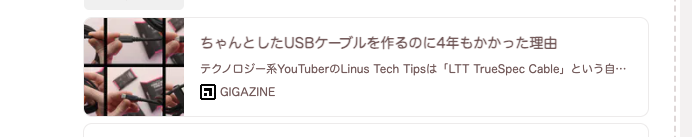
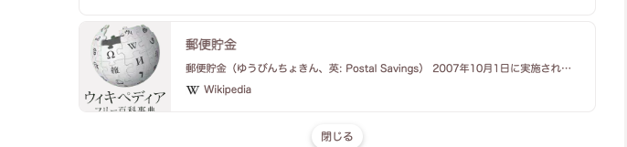
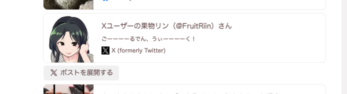
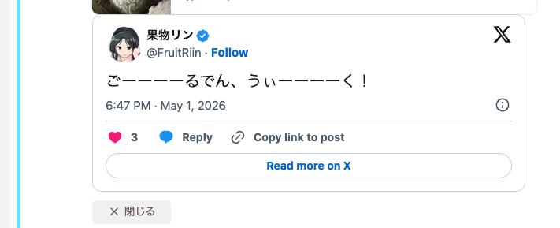
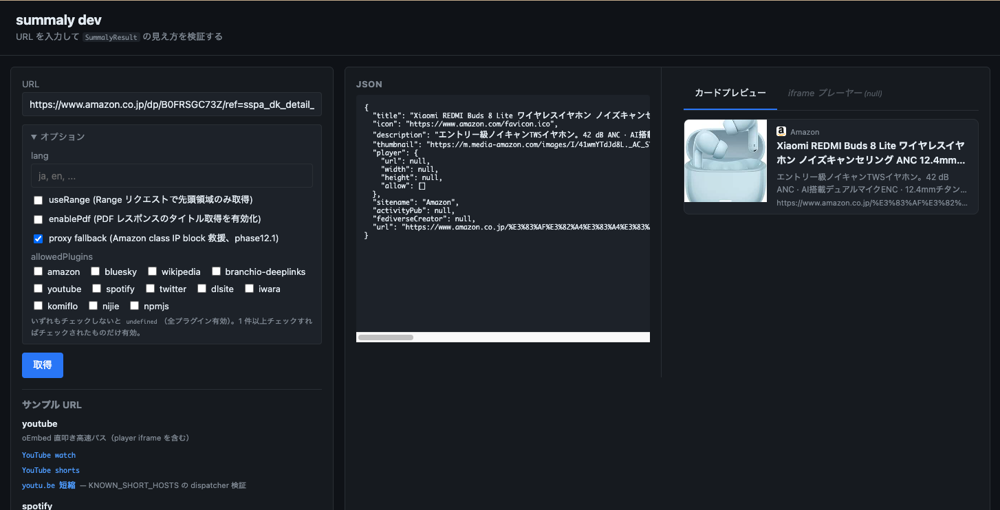

riin-summaly
================================================================

[![][npm-badge]][npm-link]
[![][mit-badge]][mit]
[![][himawari-badge]][himasaku]
[![][sakurako-badge]][himasaku]

**summaly は Misskey の note プレビューカードを生成しているライブラリ／HTTP サーバ** です。`riin-summaly` は [misskey-dev/summaly](https://github.com/misskey-dev/summaly) の fork で、本家にはまだ取り込まれていない**運用機能**（in-flight dedup・TOML 設定・JSONL 永続化・twitter プラグイン・dev UI など）を先行実装しています。Misskey 管理人として **「自分で動かして自分の運用に効く改善を入れたい」** 用途を想定しています。

<table>
<tr>
<td></td>
<td></td>
</tr>
<tr>
<td></td>
<td></td>
</tr>
</table>

URL から `title` / `description` / `thumbnail` / `icon` / `sitename` / 埋め込みプレーヤー / `medias[]`（複数画像） / ActivityPub リンク / fediverse creator 等を抽出して JSON で返します。Misskey サーバはこの JSON を受け取って上図のようなカード UI を組み立てます。

---

何ができるか
----------------------------------------------------------------

### 基本機能（本家と同等）

- **OpenGraph / Twitter Card / oEmbed / `<title>` / `<meta>`** から優先順位付きでメタ情報抽出
- **サイト固有プラグイン** で高速・正確な結果（YouTube・Spotify は oEmbed 直叩き、Wikipedia は MediaWiki API、Amazon は DOM 直接抽出など）
- **多文字コード対応**: UTF-8 / Shift_JIS / ISO-2022-JP（`jschardet` + `encoding-japanese`、[issue #39](https://github.com/misskey-dev/summaly/issues/39)）
- **SSRF 対策**: プライベート IP 拒否・レスポンスサイズ上限（10 MiB）・結果 URL のスキーム検証（`javascript:` / `data:` の sanitize）
- **PDF レスポンスのタイトル取得**（オプトイン、5 層のハング対策付き）

### riin-summaly で拡張された運用機能

| 機能 | 概要 | 関連 |
|:--|:--|:--|
| **インメモリ LRU キャッシュ** | `Cache-Control` を解釈しない HTTP クライアント（Misskey の Got 等）でも summaly サーバ単独で重複アクセスを抑える | `inMemoryCache` |
| **in-flight dedup** | Misskey ユーザーストリーミング由来の **thundering herd を 1 本化**。同 URL の並列リクエストは先頭リクエストの結果を共有し origin への同時アクセスを 1 件に絞る | `inFlightDedup`、`X-Cache: HIT-COALESCED` |
| **TOML 設定ファイル** | `pnpm serve config.toml` で起動。コメント・セクション分割が書ける運用設定 | `config.example.toml` |
| **dev サーバ UI** | `pnpm dev` で `http://127.0.0.1:3000`。URL を入れて JSON / Misskey 風カード / iframe プレーヤーを並列確認、サンプル URL ワンクリック、proxy / curl_cffi 経路の手元再現も対応 | tsx + Vanilla JS |
| **パース失敗ログ集約** | 「OG/Twitter Card/`<title>` のいずれも取れず汎用パスでスカスカになった URL」を host + path 単位で集約。**プラグイン化候補のドメイン発見器**。集約データは JSONL ファイルに `cat \| jq` でアクセス | `[diagnostics] parseFailureLog`、`parseFailureLogJsonlPath` |
| **短縮 URL の HEAD→GET fallback** | `amzn.asia` のように HEAD に 404 を返すサーバを GET fallback で正しく解決 | `KNOWN_SHORT_HOSTS` |
| **twitter (X) プラグイン** | `cdn.syndication.twimg.com` 直叩きで本文 + thumbnail + `medias[]` を返す。**player は null**（Misskey 側「ポストを展開」と重複しないように） | `(twitter\|x).com/<user>/status/<id>` |
| **経路学習キャッシュ + bootstrap** | host + path prefix 単位で 4 経路 (default / fallback_ua / proxy / curl_cffi) を学習・JSONL 永続化。bootstrap JSONL 同梱で初回コスト回避、N 連続失敗で entry 破棄 (phase14) | `[scraping.strategy_cache]` |
| **CF Workers proxy fallback** | Vultr Tokyo IP block (`amazon.co.jp` 500 等) を Cloudflare Workers の AS13335 経由で救援。HMAC-SHA256 認証 + 8 層防御 (phase12.1) | `[scraping.proxy]` |
| **curl_cffi TLS 偽装** | TLS / HTTP/2 layer の bot block (yodobashi 級 INTERNAL_ERROR) を Chrome JA3 完全再現で突破。Python CLI を `child_process.spawn` で呼ぶ (phase12.5) | `[scraping.curl_cffi]` |

---

riin-summaly vs 本家 (misskey-dev) vs mei23-summaly
----------------------------------------------------------------

| 項目 | riin-summaly | misskey-dev (本家) | mei23-summaly |
|:--|:---:|:---:|:---:|
| ベースバージョン | v5.3+ | v5.x | v3 |
| インメモリ LRU キャッシュ | ✅ | 対応予定 | ✅ |
| in-flight dedup（並列リクエスト 1 本化） | ✅ | — | — |
| TOML 設定ファイル | ✅ | (JSON) | (JSON) |
| dev サーバ UI | ✅ | — | — |
| パース失敗ログ集約 + JSONL 永続化 | ✅ | — | — |
| 短縮 URL HEAD→GET fallback (`amzn.asia` 等) | ✅ | — | — |
| 多文字コード（Shift_JIS / ISO-2022-JP） | ✅ | 対応予定 | ✅ |
| 経路学習キャッシュ + bootstrap (default / fallback_ua / proxy / curl_cffi) | ✅ | — | — |
| CF Workers proxy fallback (datacenter IP block 救援) | ✅ | — | — |
| curl_cffi TLS フィンガープリント偽装 (TLS layer bot block 突破) | ✅ | — | — |
| プラグインシステム | ✅ | ✅ | ✅ |
| youtube / youtu.be | ✅ | プレビューなし | ✅ |
| amazon | ✅ (`amzn.asia` 含む) | 基本対応 | 基本対応 |
| twitter (X) | ✅ (本文 + medias[]、player は null) | 汎用パス（薄い） | ✅ (本文のみ) |
| PDF タイトル取得（オプトイン） | ✅ | — | — |

---

Misskey 管理人として導入する場合
----------------------------------------------------------------

スタンドアロンの Fastify サーバとして起動し、Misskey 本体から `GET /?url=...` を呼ぶ構成が標準です。

```bash
git clone https://github.com/fruitriin/summaly.git
cd summaly
pnpm install --frozen-lockfile
pnpm build
cp config.example.toml config.toml   # TOML 設定をコピーして編集
pnpm serve config.toml               # = tsx bin/summaly-server.ts config.toml
```

最小設定例 (`config.toml`):

```toml
[server]
host = "127.0.0.1"
port = 3000

[summaly.cache]
inMemory = true        # Misskey の Got/node-fetch は Cache-Control を解釈しないため事実上必須
inFlightDedup = true   # ユーザーストリーミング由来の thundering herd を緩和

[plugins]
allowed = ["amazon", "bluesky", "wikipedia", "branchio-deeplinks", "youtube", "spotify", "twitter"]
```

詳細なセットアップ手順、TOML 設定スキーマ、Fastify モード固有のオプション（キャッシュ・PDF・プラグイン絞り込み・パース失敗ログ・nginx + systemd デプロイ例）、SSRF 既定値、運用上の注意点は **[docs/SETUP.md](docs/SETUP.md)** を参照してください。

---

経路優先システム（取得経路の自動選択）
----------------------------------------------------------------

riin-summaly の独自軸として、URL 取得を **4 種類の経路** に整理し、**ホスト + パス前 1〜2 段単位で第一選択肢を学習する経路学習キャッシュ + 同梱 bootstrap JSONL** によって自動最適化します。WAF / IP block / TLS フィンガープリント検査 / SNS bot UA allowlist 等、サイトごとに異なる bot 排除レイヤーに対し、**プラグインは extraction (DOM 直読み・公式 API 直叩き・URL 正規化) の自在性専用、経路選択は経路学習キャッシュ専用** という責務分離になっています。

### 4 経路

| 経路 | 内部キー | 概要 | 採用例 |
|:--|:--|:--|:--|
| **Summaly UA** | `default` | デフォルト UA `SummalyBot/<version>` で got 経由スクレイプ。最初の選択肢 | 大多数のサイト |
| **SNS Preview Bot UA** | `fallback_ua` | `facebookexternalhit/1.1` / `Twitterbot/1.0` 等の SNS bot UA に偽装。WAF allowlist 通過 / PV カウント除外狙い / `SummalyBot` 文字列で弾かれる WAF の救援 | `nintendo-store` (Akamai 突破), `kakuyomu` (PV 除外), 汎用 fallback (phase11.9) |
| **Proxy 経由** | `proxy` | Cloudflare Workers Free を outbound proxy として経由。Vultr Tokyo IP 等の **datacenter IP block** を CF (AS13335) 経由で救援。HMAC-SHA256 認証 + 8 層防御 | `amazon` (`amazon.co.jp` 500 救援), `sqex` (DC IP block) |
| **curl_cffi** | `curl_cffi` | `tools/curl-cffi-fetcher/` の Python CLI を spawn し、Chrome / Firefox / Safari の **TLS フィンガープリント (JA3) を完全再現**。`SummalyBot` どころか Mozilla UA でも HTTP/2 INTERNAL_ERROR を返す **TLS / HTTP/2 layer の bot block** を突破 | `yodobashi` (TLS block 救援)、`nitori` ※ (TLS block + datacenter IP 全般 block の fail mode J、家庭用 IP のみ救援可) |

これらと直交して、抽出 (extraction) 戦略は別軸です（**公式 JSON API / oEmbed 直叩き** で HTML スクレイプ自体を回避するもの: `wikipedia` / `npmjs` / `syosetu` / `youtube` / `spotify` / `nitori`、**内部 CDN 直叩き** (公式 API ではないが widget 用 JSON が露出している経路): `twitter` (`cdn.syndication.twimg.com` — X の仕様変更で壊れうる)、**HTML 内 state JSON parse**: `kakuyomu`、**DOM 直接抽出**: `amazon`）。経路と抽出戦略は組み合わせ可能で、例えば `kakuyomu` は「SNS Bot UA で取得した HTML」から `__NEXT_DATA__` の Apollo state を parse する複合戦略、`nitori` は「curl_cffi で TLS block を迂回 + 公式 JSON API 直叩き」を試みる戦略です (ただし `nitori` は datacenter IP block で本番 VPS では機能しない、`docs/knowhow/spa-dynamic-ogp-unfixable.md` 参照)。

### 経路学習キャッシュ (phase14)

- **学習**: scpaping が成功した経路を `host` + `pathPrefix` (1〜2 段) 単位で JSONL ファイルに記録
- **第一選択肢化**: 次回以降のリクエストは cache hit fast path で学習済み経路を直接呼び出し、初回 cascade (`default` 20 秒空回り → fallback) のコストを回避
- **bootstrap**: `data/domain-strategy-bootstrap.jsonl` をリポ同梱 (`yodobashi.com → curl_cffi`、`store.jp.square-enix.com → proxy`、`amazon.co.jp/dp` → `proxy` 等) で初回コストもゼロに
- **runtime layer**: 環境固有の学習結果 (`data/domain-strategy-runtime.jsonl`、gitignored) を bootstrap に重ね合わせ
- **N 連続失敗で破棄**: 学習した経路がサイト側仕様変更等で機能しなくなった場合は閾値到達で entry 破棄、bootstrap 値は次回起動時に再ロードされず無効化マーカー JSONL で打ち消し

設定は `[scraping.strategy_cache]` で `enabled = true` (デフォルト)。詳細は [docs/SETUP.md](docs/SETUP.md#経路学習キャッシュ-phase14-step-1) を参照。

---

対応サイト（プラグイン一覧）
----------------------------------------------------------------

サイト固有プラグインは登録順にマッチし、最初に当たったものが採用されます。マッチしなかった URL は汎用パスで OG / Twitter Card / oEmbed から抽出されます。

| プラグイン | 対象 | 経路 | 概要 |
|:--|:--|:--|:--|
| `amazon` | `(?:www\.)?amazon.{com, co.jp, ...}` + `amzn.asia` / `amzn.to` / `a.co` 短縮 | Summaly UA → Proxy | DOM (`#title` 等) と OG meta から抽出。短縮 URL は 2 段取得 (final URL から ASIN 抽出 → canonical 再取得)。Vultr Tokyo IP block は経路学習キャッシュ + bootstrap で proxy に切替 |
| `bluesky` | `bsky.app` | Summaly UA | HEAD が 404 になるため GET のみで取得 |
| `wikipedia` | `*.wikipedia.org` | 公式 API | MediaWiki API から intro テキスト取得 |
| `branchio-deeplinks` | `*.app.link` / `spotify.link` | Summaly UA | `$web_only=true` を付けて Web 版にリダイレクトさせ汎用パスへ |
| `youtube` | `(www\|m).youtube.com/{watch,v,playlist,shorts}` / `youtu.be` | 公式 API | oEmbed エンドポイント直叩きで 1 リクエスト |
| `spotify` | `open.spotify.com` | 公式 API | oEmbed エンドポイント直叩き |
| `twitter` | `(twitter\|x).com/<user>/status/<id>` | 内部 CDN (非公式) | `cdn.syndication.twimg.com` から JSON 取得して title/description/thumbnail を返す。複数画像は `medias[]`、player は null（Misskey の「ポストを展開」と重複しないため）。**X 側仕様変更で壊れうるため要メンテ** |
| `dlsite` | `www.dlsite.com` | Summaly UA | `/announce/` ↔ `/work/` の 404 リトライ + パス分類で sensitive 判定。**sensitive 時 card 抑制 + embed フル表示** (`/maniax/` 等のアダルト経路。`/comic/` 等のセーフパスは素通し、phase15.6) |
| `iwara` | `(www\|ecchi).iwara.tv` | Summaly UA | description / thumbnail を DOM から補完。**全件 sensitive=true 強制 + card 抑制 + embed フル表示** (MMD/3D モデルアニメで R-15〜R-18 が混在するため、phase15.6 followup) |
| `komiflo` | `komiflo.com/comics/<id>` | Summaly UA | thumbnail フォールバック時に `api.komiflo.com` から取得 + sensitive。**card 抑制 + embed フル表示** (phase15.6) |
| `nijie` | `nijie.info/view.php` | Summaly UA | JSON-LD `ImageObject` から description / thumbnail を補完 + sensitive。**card 抑制 + embed フル表示** (phase15.6) |
| `npmjs` | `(www.)?npmjs.com/package/...` | 公式 API | Cloudflare 配下の HTML を諦め `registry.npmjs.org` を直叩き、`dist-tags.latest` から title / description を組み立てる |
| `nintendo-store` | `store(-<TLD>)?.nintendo.com` | SNS Bot UA | Akamai JS challenge 回避: UA を `facebookexternalhit/1.1` に固定して OGP 取得 (Nintendo が SNS bot UA を allowlist している事実を利用) |
| `yodobashi` | `(www.)?yodobashi.com` | curl_cffi | TLS/HTTP2 層で bot 切断される厳しい WAF。経路学習キャッシュ + bootstrap で curl_cffi (Chrome JA3 偽装) 直行 |
| `sqex` | `(www.)?store.jp.square-enix.com` (短縮 `sqex.to/<id>`) | Proxy | データセンター IP を CDN 段で広く弾く新パターン (HTTP 200 + 正規 404 ページボディ)。経路学習キャッシュ + bootstrap で proxy 直行 |
| `syosetu` | `(ncode\|novel18).syosetu.com/n<id>/` | 公式 API | 小説家になろう公式 API 直叩き → 作品名 / 作者 / ジャンル / 連載状態 / あらすじを取得。`/embed` で iframe 用 HTML を返す (phase13.1)。R-18 ドメインで `sensitive: true` |
| `kakuyomu` | `kakuyomu.jp/works/<id>(/episodes/<eid>)?` | SNS Bot UA | カクヨム公式 API が無いため `Twitterbot/1.0` UA で HTML を取得し `<script id="__NEXT_DATA__">` の Apollo state JSON から作品名 / 作者 / ジャンル / 連載状態 / あらすじ / 作品サムネを抽出。`/embed` で iframe 用 HTML を返す (phase15.2)。`isSexual: true` で `sensitive: true` |
| `nitori` ※ | `(www.)?nitori-net.jp/ec/product/<sku>/` | 公式 API + curl_cffi | 商品詳細を SAP Commerce OCC API (`/occ/v2/nitorinet/nitori/products/<sku>`) を curl_cffi (Chrome JA3 偽装) で直叩き。**※ datacenter IP 全般 block (fail mode J) のため Vultr 等の VPS からは救援不可**、家庭用 IP / library 直接利用者のみ動作。`[plugins].allowed` 既定でコメントアウト (phase15.4) |
| `dmm` ※ | `dmm.co.jp` 全サブドメイン (`/age_check` 除く) | SNS Bot UA | DMM / FANZA は全サブドメインで年齢認証ゲートが `Vary: User-Agent` で挟まる。`facebookexternalhit/1.1` UA は allowlist されゲート素通しで OGP を返すため UA を固定して取得。`skipRedirectResolution = true` で HEAD probe による gate 書き換えを回避、`sensitive: true` 固定。**card は title 「【サイト名】ページ名」 / description 「【R-18】 内容を伏せています」 / thumbnail null で NSFW 抑制、embed iframe (`renderEmbed`) で作品サムネ・あらすじをフル表示** (phase15.3 → phase15.5)。NSFW 慣例で `[plugins].allowed` 既定でコメントアウト |
| `google-drive` | `drive.google.com/file/d/<id>/...` | URL 直接組み立て + thumbnail/OGP | 共有ファイルの動画 / PDF / 画像 / Docs をインライン表示。**embed 有効時は Drive `/preview` iframe を CSS `cqi` scale で縮小ラップ** (内部 900px 描画 → カード幅に追従縮小、JS なし) して**スマホ幅でもコントロールが崩れない**ようにする、embed 無効時は `/preview` iframe 直。公開 thumbnail の pixel 寸法から **実アスペクト比を判定** (縦動画は縦長)、`/view` OGP から file 名を title 補完。`skipRedirectResolution = true`。**Google フォト (`photos.google.com`) は `X-Frame-Options: SAMEORIGIN` で iframe 不可のため非対応** (phase19.1) |

各プラグインの詳細仕様、カスタムプラグインの書き方、共通ユーティリティは **[docs/Plugins.md](docs/Plugins.md)** にあります。

---

ライブラリとして直接利用する場合
----------------------------------------------------------------

Node.js プロジェクト内で `summaly()` 関数を直接 import して使うこともできます。Fastify モード専用の機能（`inFlightDedup` / `inMemoryCache` / `parseFailureLog` 等）は無効ですが、URL → SummalyResult の関数だけが欲しい場面で使えます。API リファレンス・戻り値型・全オプションは **[docs/Library.md](docs/Library.md)** を参照してください。

```javascript
import { summaly } from 'summaly';
const summary = await summaly('https://example.com/article');
console.log(summary.title, summary.description, summary.thumbnail);
```

---

開発
----------------------------------------------------------------

```bash
pnpm install
pnpm build              # tsdown で ./built に出力
pnpm test               # vitest（200+ ケース）
pnpm eslint             # ESLint
pnpm typecheck          # tsc --noEmit (src + test + dev/bin の 3 構成)
pnpm serve config.toml  # Fastify サーバ起動（TOML 設定）
pnpm dev                # 動作確認 UI（http://127.0.0.1:3000、tsx で src/ を直接実行）
```

### 動作確認 UI (`pnpm dev`)

`pnpm dev` で `http://127.0.0.1:3000` に動作確認用の Web UI が立ち上がります。本番 bundle (`./built/`) には含まれない dev 専用ツールです。



- 左ペインに **JSON 常時表示**、右ペインに **Misskey 風カードプレビュー** / **iframe プレーヤー** のタブ
- 組み込みプラグイン対応サイトのサンプル URL を**ワンクリック**で入力欄に流し込める（PDF サンプルは `enablePdf` も、Amazon proxy サンプルは `proxy` も自動 ON）
- `lang` / `useRange` / `enablePdf` / `allowedPlugins` を**リクエスト単位**で切り替え可能
- ローカル URL をプレビューできるよう `SUMMALY_ALLOW_PRIVATE_IP=true` を **dev サーバ内に閉じて** 設定（シェル env を汚染せず、`pnpm serve` 本番には影響しない）
- iframe は `referrerpolicy` を browser default に戻し、YouTube oEmbed の「エラー 153」を回避

#### 経路優先システムの手元再現 (phase12.1 / 12.5 / 14)

dev サーバは経路学習キャッシュを有効化した状態で起動し、同梱 `data/domain-strategy-bootstrap.jsonl` を自動ロードします。`/api/strategy-cache` で cache の中身を JSON で確認可能です (どのドメインがどの経路に学習されているかを観察できる)。

ただし **bootstrap で学習済みの経路 (curl_cffi / proxy) を実際に発火させるには、各経路の設定 (proxy なら env、curl_cffi なら `tools/curl-cffi-fetcher/` セットアップ + TOML) が必要** です。設定が無い経路は cache fast path で gate を通れず通常 scpaping にフォールスルーします。

##### Proxy 経由 (CF Workers) の手元再現

Vultr Tokyo IP からの `amazon.co.jp` が IP レピュテーション層で 500 を返す問題を、Cloudflare Workers 経由で救援する [phase12.1 の proxy fallback](docs/plans/phase12.1-cf-workers-proxy-fallback.md) を dev サーバから動作確認できます。

```bash
export SUMMALY_PROXY_URL="https://summaly-proxy.<your>.workers.dev"
export SUMMALY_PROXY_SECRET="<wrangler secret put SHARED_SECRET と同値>"
pnpm dev
```

両方の環境変数がセットされていると **proxy fallback (Amazon class IP block 救援、phase12.1) checkbox** が表示されます（env 未設定なら hidden、運用者の混乱を回避）。サンプル URL「Amazon JP (proxy 経由 — IP block 救援)」をクリックすると `presets.proxy: true` が自動適用されるので、ワンクリックで proxy 経由 Amazon プレビューを試せます。

Worker 側のデプロイ手順は [tools/cf-proxy-worker/README.md](tools/cf-proxy-worker/README.md)、運用設定は [docs/SETUP.md の proxy セクション](docs/SETUP.md#outbound-proxy-フォールバック-phase121) を参照してください。

##### curl_cffi の手元再現

`yodobashi.com` のような TLS layer bot block サイトを dev で再現するには、`tools/curl-cffi-fetcher/` のセットアップが必要です ([docs/SETUP.md の curl_cffi セクション](docs/SETUP.md#curl_cffi-tls-layer-bot-block-フォールバック-phase125) 参照)。

```bash
cd tools/curl-cffi-fetcher && uv sync && cd ../..
pnpm dev
```

`config.toml` 経由ではなく `[scraping.curl_cffi]` 相当の設定を dev サーバに渡す手段は現状無いため、**curl_cffi の手元動作確認は `pnpm serve config.toml` 経由を推奨**します (`config.example.toml` の `[scraping.curl_cffi] enabled = true` セクションを参照)。

> ⚠️ proxy / curl_cffi 機能を使う場合は **デフォルト `HOST=127.0.0.1` を変更しないこと**。dev サーバは `SUMMALY_ALLOW_PRIVATE_IP=true` をプロセス内で固定セットしているため、`HOST=0.0.0.0` で起動すると LAN 内の別ホストから `?proxy=1` を叩かれる経路ができます（Worker 側 allowlist で守られていますが、二重防御として）。

`PORT` / `HOST` 環境変数で待ち受けを変更可能（デフォルト `127.0.0.1:3000`）。

### 設計ドキュメント

- **[docs/SETUP.md](docs/SETUP.md)**: 本番運用ガイド（TOML 設定・キャッシュ戦略・パース失敗ログ・nginx/systemd 例）
- **[docs/Plugins.md](docs/Plugins.md)**: プラグイン詳細仕様・カスタムプラグインの書き方
- **[docs/Library.md](docs/Library.md)**: `summaly()` 関数の API リファレンス
- **[DEPRECATED.md](DEPRECATED.md)**: 廃止された機能と移行ガイド（旧 fastify-cli / 診断エンドポイント / forceX フラグ等）
- **[docs/knowhow/](docs/knowhow/)**: 実装中に蓄積した設計知見（in-flight dedup・TOML loader・dev サーバ・パース失敗ログ等）
- **[docs/plans/](docs/plans/)**: 各 phase の設計プラン（実装の意思決定の経緯）

---

ライセンス
----------------------------------------------------------------

[MIT](LICENSE)

[mit]:            http://opensource.org/licenses/MIT
[mit-badge]:      https://img.shields.io/badge/license-MIT-444444.svg?style=flat-square
[himasaku]:       https://himasaku.net
[himawari-badge]: https://img.shields.io/badge/%E5%8F%A4%E8%B0%B7-%E5%90%91%E6%97%A5%E8%91%B5-1684c5.svg?style=flat-square
[sakurako-badge]: https://img.shields.io/badge/%E5%A4%A7%E5%AE%A4-%E6%AB%BB%E5%AD%90-efb02a.svg?style=flat-square
[npm-link]:       https://www.npmjs.com/package/@misskey-dev/summaly
[npm-badge]:      https://img.shields.io/npm/v/@misskey-dev/summaly.svg?style=flat-square
